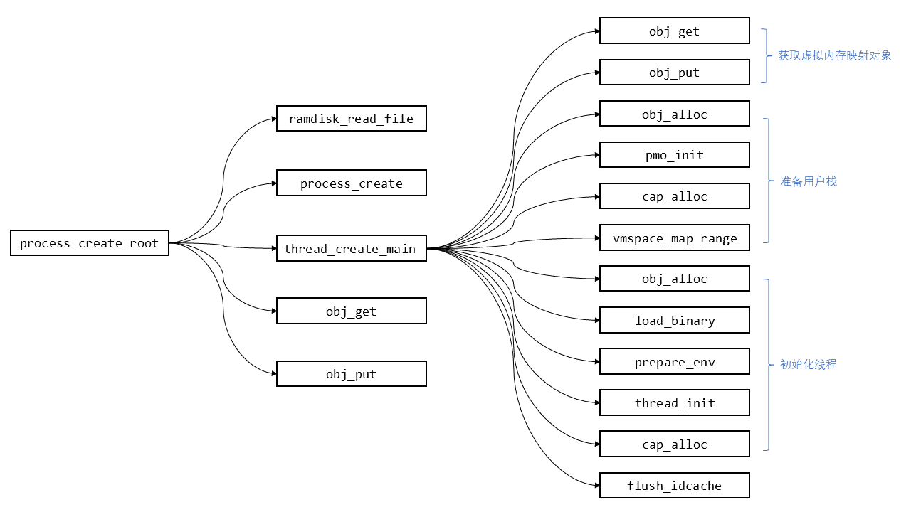

# 实验3: 用户进程与异常处理

## 练习2

请简要描述process_create_root这一函数所的逻辑。注意：描述中需包含thread_create_main函数的详细说明，建议绘制函数调用图以描述相关逻辑

------

**process_create_root**(kernel/process/process.c)

1. **ramdisk_read_file **: 从`ramdisk`中读取名为`bin_name`的二进制程序文件

2. **process_create** ：创建`root`进程

3. **thread_create_main** ：创建`root`进程的主线程

   1. **obj_get** : 获取`root`进程`slot_id`为`VMSPACE_OBJ_ID`的`object`

      * **get_opaque**

      因为所有的资源都被`object`类型所抽象，其中的`opaque`字段就是指向真正的资源。

      根据`cap`（即`slot_id`）来查找`object_slot`，之后取出`object`的`opaque`字段返回，即返回了`Cap`对应的真实对象本身，此处是取出了*虚拟内存映射*的相关信息

   2. **obj_put** : 与`obj_get`相对应。类似于打开文件后会将`ref_cnt`增加，需要对应直行关闭文件才能减少`ref_count`。相应的，get和put的时候会改变`refcount`的值，因此如果不是一一对应的话可能会造成无法正常释放内存空间或是提前释放

      *3-6：为初始化线程创建和分配占空间*

   3. **obj_alloc** : 分配一个物理内存对象，类型为`TYPE_PMO`，大小为`sizeof(*stack_pmo)`，用于栈空间

   4. **pmo_init** : 初始化刚刚分配的物理内存对象`stack_pmo`，分配`stack_size`大小的空间

   5. **cap_alloc **: 为访问这一内核对象`stack_pmo`，分配对应的`Cap` 

      因为所有的内核资源均被抽象为了内核对象（kernel object），应用程序通过整型的标识符Capability 访问从属于该进程的内核对象。

   6. **vmspace_map_range** ：将物理内存对象`stack_pmo`映射到从`init_vmspace`开始的虚拟内存

      *7-11：初始化线程*

   7. **obj_alloc** ：分配一个线程对象，类型为`TYPE_THREAD`，大小为`sizeof(*thread)`

   8. **load_binary** ：解析ELF 文件，并将其内容加载到进程的用户内存空间中

   9. **prepare_env** ：为进程设置栈环境。内核栈的栈顶地址设置为`phys_to_virt(stack_pmo->start) + stack_size`，用户栈的栈顶地址为`stack`

   10. **thread_init** ：初始化线程

   11. **cap_alloc** ：通过`cap_alloc(process, thread, 0)`将线程加入到进程的`slot_table`中，并且返回cap，最终返回给用户

   12. **flush_idcache** ：使`icache`和`dcache`一致
   
4. **obj_get**  ：取出`thread_cap`对应的线程对象

5. **obj_put** ：与`obj_get`相对应。

6. 最后将当前线程设置为刚才获取的线程

`process_create_root`函数创建`root`进程。

执行逻辑首先通过`ramdisk_read_file`将二进制文件读入，再通过`process_create`创建进程。因为一个进程需要一个线程，所以再通过`thread_create_main`函数创建主线程，也就是第一个线程，并且获得标识符`thread_cap`。

由于公开给应用程序的所有内核资源均采用`Capability`机制进行管理。所有的内核资源（包括线程）均被抽象为了内核对象`kernel object`，应用程序通过整型的标识符`Capability` 访问从属于该进程的内核对象。所以最后还需要通过`obj_get`，使用标识符`thred_cap`获得主线程。由于`obj_get`会将对象的`refcount`加一，所以需要通过`obj_put`将`refcount`减一。最后将`current_thread`设为主线程，就完成了`process_create_root`的操作。

`thread_create_main`函数创建进程的第一个线程。

创建线程需要准备用户栈和确定线程的`entry point`，以对线程初始化。而准备用户栈，需要映射物理内存和虚拟内存。所以先使用标识符`VMSPACE_OBJ_ID`，通过`obj_get`和`obj_put`操作获取有关虚拟内存映射的对象。再通过`obj_alloc`, 分配一个物理内存对象。使用`pmo_init`，对该物理内存对象进行初始化，分配`stack_size`大小的物理内存。因为所有内核资源均采用`Capability`机制进行管理，所以需要通过`cap_alloc`函数分配一个管理该对象的标识符。最后通过` vmspace_map_range`函数映射栈的虚拟空间和物理空间，就完成了线程的用户栈的准备。

初始化线程需要先分配一个线程内核对象。所以先使用`obj_alloc`分配线程对象。初始化线程还需要`entry point`作为参数。所以先通过`load_binary`函数，从二进制文件中获取`entry point`。`prepare_env`函数为进程设置栈环境。内核栈的栈顶地址设置为`phys_to_virt(stack_pmo->start) + stack_size`，用户栈的栈顶地址为`stack`。最后使用`thread_init`函数初始化线程。因为所有内核资源均采用`Capability`机制进行管理，所以需要通过`cap_alloc`函数分配一个管理线程对象的标识符。

因为修改了指令，所以需要`flush_idcache`函数，保证`icache`和`dcache`的一致性。最后就完成了`thread_create_main`函数。

函数调用图：




## 练习4

请阅读kernel/exception/exception_table.S中的代码， 并简要描述ChCore 是如何将系统调用从异常向量分派到系统调用表中对应条目的。

-----

```assembly
el0_syscall:
	...

	adr	x27, syscall_table		// syscall table in x27
	uxtw	x16, w8				// syscall number in x16
	ldr	x16, [x27, x16, lsl #3]		// find the syscall entry
	blr	x16

	/* Ret from syscall */
	// bl	disable_irq
	str	x0, [sp] /* set the return value of the syscall */
	exception_exit
```

进入异常向量表中匹配到`el0_syscall`。

先保存上下文后，再通过上述指令获取`syscall_table`的PC相对地址，通过存储在`x16`中的`syscall number`计算出`syscall entry`。最后调转到该地址，即完成了从异常向量分派到系统调用表中的对应条目。


## 练习7

请使用GDB 检查START函数执行结束后程序计数器的值，解释为何会发生这一现象，并尝试在ChCore 的异常处理器中处理对应类型的异常。

------

```g
(gdb) b START
Breakpoint 1 at 0x400130
(gdb) b _start_c
Breakpoint 2 at 0x400148
(gdb) c
Continuing.

Thread 1 hit Breakpoint 1, 0x0000000000400130 in START ()
(gdb) s
Single stepping until exit from function START,
which has no line number information.

Thread 1 hit Breakpoint 2, 0x0000000000400148 in _start_c ()
(gdb) s
Single stepping until exit from function _start_c,
which has no line number information.
0x0000000000400110 in main ()
(gdb) s
Single stepping until exit from function main,
which has no line number information.
0x0000000000000000 in ?? ()
(gdb) s
Cannot find bounds of current function
```

根据GDB可以看到在`START`函数中调用了`_start_c`函数后，最终调用了`main`函数后，程序计数器的值为`0x0`，`Cannot find bounds of current function`

根据打印信息

```
[DEBUG] Interrupt type: 8, ESR: 0x82000006, Fault address: 0x0, EC 0b20
[DEBUG] Unsupported Exception ESR 8QEMU: Terminated
```

可以看到是因为发生了异常`ESR_EL1_EC_IABT_LEL`： Instruction Abort from a lower Exception level) ，并且没有支持处理相应的异常而发生错误。

于是在`exception.c`文件中加入异常处理：

```c
case ESR_EL1_EC_IABT_LEL:
case ESR_EL1_EC_IABT_CEL:
		sys_exit(0);
     	break;
```

